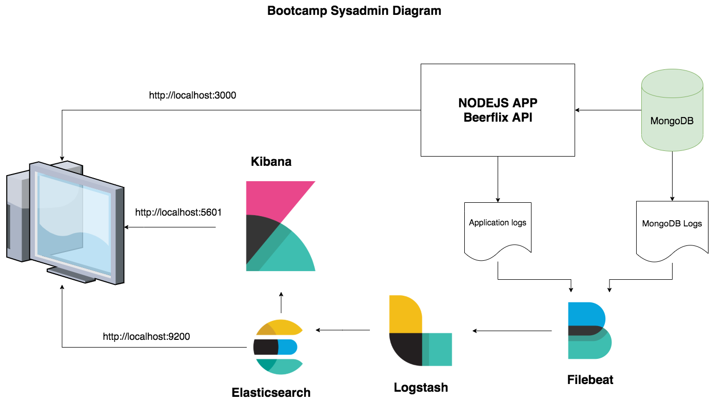

# Bootcamp - sysadmin practice

In this repo, you will find a way to install ELK Stack, MongoDB database and node.js app who uses mongo as a database.

ELK is in charge to register MongoDB and Node.js API logs, using Filebeat, Logstash and Elasticsearch to digest those logs and Kibina to show them.

## Architecture diagram



---

## How to run

For this example, we decided to use Vagrant and it was developed and tested in a macOS environment. To run this you have to execute:

```
vagrant up
```

After this command executes each step, you will have access to these endpoints. (We want in the future to unify this in an Nginx server as we explain in the  [future steps section](#future-steps-section) at the bottom of this document)

These routes are

* NodeJS API http://localhost:3000
* KIBANA http://localhost:5601
* ELasticSearch http://localhost:9200

If you want to check the logs you have to go to Kibana and create an Index as it is shown in this video.


---

## ELK installation

To install this stack. We decided to use the official documentation https://www.elastic.co/guide/en/elastic-stack/6.8/installing-elastic-stack.html and the 6.x version as with 7 we found some issues connecting Kibana and elastic search.

Everything of these commands is in `bootstrap.sh` file registered to automatize this installation.

### Elastic search

```
# Install Java

## update apt
sudo apt-get update
sudo apt-get install -y unzip git apt-transport-https default-jre

java -version
echo "Java Home is"
echo $JAVA_HOME

# Elastic search
echo "Elastic Search scripts"

## Import elastic PGP key

wget -qO - https://artifacts.elastic.co/GPG-KEY-elasticsearch | sudo apt-key add -

## Installing from the APT repository
sudo apt-get install apt-transport-https
echo "deb https://artifacts.elastic.co/packages/6.x/apt stable main" | sudo tee -a /etc/apt/sources.list.d/elastic-6.x.list

sudo apt-get update && sudo apt-get install elasticsearch=$ELK_VERSION

## init Elasticsearch

echo "Install elastic search"
cp /vagrant/elasticsearch/elasticsearch.yml /etc/elasticsearch/
sudo systemctl daemon-reload
sudo systemctl enable elasticsearch.service
sudo systemctl start elasticsearch.service

echo "Elasticsearch installed"
```

Elasticsearch configuration file

```
path.data: /var/lib/elasticsearch
path.logs: /var/log/elasticsearch
network.host: 0.0.0.0
```

### KIBANA

```
# Kibana search
echo "Install Kibana"

## update packages
sudo apt-get update && sudo apt-get install -y kibana=$ELK_VERSION

# init kibana
cp /vagrant/kibana/kibana.yml /etc/kibana/
sudo systemctl daemon-reload
sudo systemctl enable kibana.service
sudo systemctl start kibana.service

echo "Kibana installed"
```

Kibana configuration file

```
server.host: "0.0.0.0"
```

### Logstash

```
echo "Logstash install"

# Install logstash
sudo apt-get update && sudo apt-get install logstash

# copy over configs
cp -R /vagrant/logstash/* /etc/logstash/conf.d/
sudo systemctl enable logstash.service
sudo systemctl start logstash.service
```

Logstash config app file.

```
input {
  beats {
    port => "5044"
  }
}
 
output {
  elasticsearch {
    hosts => ["localhost:9200"]
  }
}
```
### Filebeat

```
echo "Install filebeat"
curl -L -O https://artifacts.elastic.co/downloads/beats/filebeat/filebeat-$ELK_VERSION-amd64.deb
sudo dpkg -i filebeat-$ELK_VERSION-amd64.deb

# copy over configs
cp -R /vagrant/filebeat/filebeat.yml /etc/filebeat/
sudo systemctl enable filebeat.service
sudo systemctl start filebeat.service
```

Filebeat configuration file

```
filebeat.prospectors:
- type: log
  enabled: true
  paths:
    - /var/log/node-app.log
    - /var/log/mongodb/mongod.log
output.logstash:
  hosts: ["localhost:5044"]
```

---

### MongoDB for the Node.js API

```
# Install mongodb
echo "MongoDB install"
wget -qO - https://www.mongodb.org/static/pgp/server-4.2.asc | sudo apt-key add -
sudo apt-get install -y gnupg

wget -qO - https://www.mongodb.org/static/pgp/server-4.2.asc | sudo apt-key add -

echo "deb [ arch=amd64,arm64 ] https://repo.mongodb.org/apt/ubuntu xenial/mongodb-org/4.2 multiverse" | sudo tee /etc/apt/sources.list.d/mongodb-org-4.2.list

sudo apt-get update
sudo apt-get install -y mongodb-org

## Running mongodb
sudo systemctl daemon-reload
sudo systemctl enable mongod
sudo systemctl start mongod
```

---

### Provision API

```
echo "Setup permission for app logs"
# Setup permission for app logs
sudo touch /var/log/node-app.log
sudo chgrp vagrant /var/log/node-app.log
sudo chown vagrant /var/log/node-app.log

echo "Provision app"
# Provision app
cp /vagrant/app/bootstrap.sh /home/vagrant
cp /vagrant/app/nodeserver.service /etc/systemd/system/
sudo chmod +x bootstrap.sh
sudo su -c ./bootstrap.sh - vagrant
```

## API Bottstrap file

We create a different bootstrap file for the Node.JS API. We are using an API We created for Keepcoding web bootcamp so that it only download from my repository and starts with systemd.

```
#!/usr/bin/env bash

echo "Configure app"

## Installing git
sudo apt-get update
sudo apt install -y git-all

echo "smoke test git"
git --version


## Installing node
curl -sL https://deb.nodesource.com/setup_12.x | sudo -E bash -
sudo apt-get install -y nodejs

echo "smoke test node"
node --version


## cloning the repo
git clone --branch log-file https://github.com/kevinccbsg/web-bootcamp-exercise-beer-api.git

cd web-bootcamp-exercise-beer-api

## Installing dependencies
npm i

export DB_URL=mongodb://localhost:27017/beerapi

## load beer info
npm run loadData

# run app with systemctl
sudo systemctl enable nodeserver.service
sudo systemctl start nodeserver.service
```

This APP uses a systemctl service for restarts

```
[Unit]
Description=Beerflix API
Requires=After=mongod.service       # Requires the mysql service to run first

[Service]
ExecStart=/usr/bin/node /home/vagrant/web-bootcamp-exercise-beer-api/bin/www
# Required on some systems
WorkingDirectory=/home/vagrant/web-bootcamp-exercise-beer-api
Restart=always
# Restart service after 10 seconds if node service crashes
RestartSec=15
# Output to syslog
StandardOutput=syslog
StandardError=syslog
SyslogIdentifier=nodejs-example
#User=<alternate user>
#Group=<alternate group>
Environment=NODE_ENV=production PORT=3000 DB_URL=mongodb://localhost:27017/beerapi

[Install]
WantedBy=multi-user.target
```

## future steps section

There are still some improvements in the backlog as:

1. Secure connection from the API to the MongoDB database. We want to use this script but because times fly we couldn't.

    ```
    mongo admin -u $MONGO_INITDB_ROOT_USERNAME -p $MONGO_INITDB_ROOT_PASSWORD --eval "db.getSiblingDB('$MONGO_DB_APP_DATABASE').createUser({user: '$MONGO_DB_APP_USERNAME', pwd: '$MONGO_DB_APP_PASSWORD', roles: [{role: 'readWrite', db: '$MONGO_DB_APP_DATABASE'}]});"
    ```
    And then send it as a ENV variable to the provission script.

2. Add Nginx as a proxy to not expose all the different ports. Using it as a reverse proxy. We want to do something like this https://github.com/kevinccbsg/bootcamp-mobile-node/blob/master/nginx.conf for Kibana, Elastichsearch and the API.
3. Improve disk management. We have a problem when we create the partition as our node app was not working properly. Although We add the right disk management commands in the bootstrap file, we couldn't add it as it didn't allow us to use the API.
4. Play with Logstash filter and Kibana index to optimize the log results.

These points weren't prioritized as it covers topics not related to the course, Nodejs app management, elk improvements, and MongoDB config.

